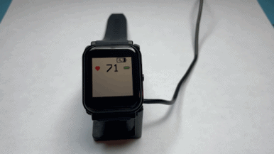

## Project Overview

The start of a project where I take a [Bangle.js 2 Smart Watch](https://www.espruino.com/Bangle.js2) and write custom C/C++ firmware to connect to a [Polar Heart Rate Monitor](https://www.polar.com/us-en/products/heart-rate-sensors) over Bluetooth Low Energy (BLE). The firmware is a bit rough at this point of time though.

## Notes
* [Font Smoothing](https://github.com/adamgreen/nrf52-SmartWatch/blob/main/docs/FontSmoothing.md#font-smoothing) - Some notes about the code I wrote to help smooth out the default font used by the Adafruit-GFX library.